# ✈️ Executive Travel Planner

### *The Complete Travel Management System for Executive Assistants & Personal Assistants*

**Version 4.1** – *Responsive Travel Pack with Light/Dark Theme, Date-Aligned Per-Stop Weather, USD-Normalized Dashboard, Duplicate Detection, and Safety Confirmations Across Every Destructive Action*


---

## 📋 Table of Contents

- [Overview](#overview)
- [Screenshots](#-screenshots)
- [What's New](#-whats-new-v41)
- [Full Feature Breakdown](#-full-feature-breakdown)
- [Tech Stack](#️-tech-stack)
- [Installation & Setup](#-installation--setup)
- [Running the App](#️-running-the-app)
- [How the PA/EA Uses It (Daily Workflow)](#-how-the-paea-uses-it-daily-workflow)
- [Complete Export Matrix](#-complete-export-matrix)
- [What Each Export Looks Like](#-what-each-export-looks-like)
- [File Structure](#-file-structure)
- [Currency & Date Management](#-currency--date-management)
- [Duplicate Detection](#-duplicate-detection)
- [Extending the Tool](#-extending-the-tool)
- [Data Backup](#-data-backup)
- [Troubleshooting](#-troubleshooting)
- [License](#-license)

---

## Overview

Stop juggling between spreadsheets, Word docs, and calendar invites. This single Python application lets **one PA/EA** manage **multiple executives across multiple companies** – from storing detailed travel profiles to generating polished itineraries, expense reports, and a mobile-ready travel pack the executive can actually use on the road.

**Best of all:** 100% local. No cloud fees. No API subscriptions. All data stays on your machine.

---

## 📸 Screenshots

<table>
<tr>
<td width="50%">
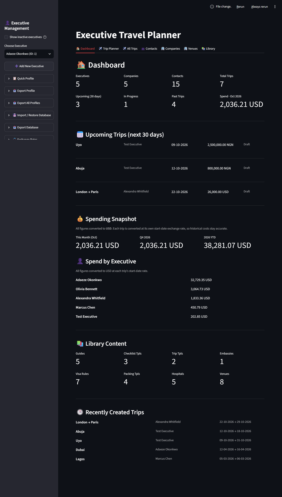
<p align="center"><em>Dashboard — at-a-glance metrics</em></p>
</td>
<td width="50%">
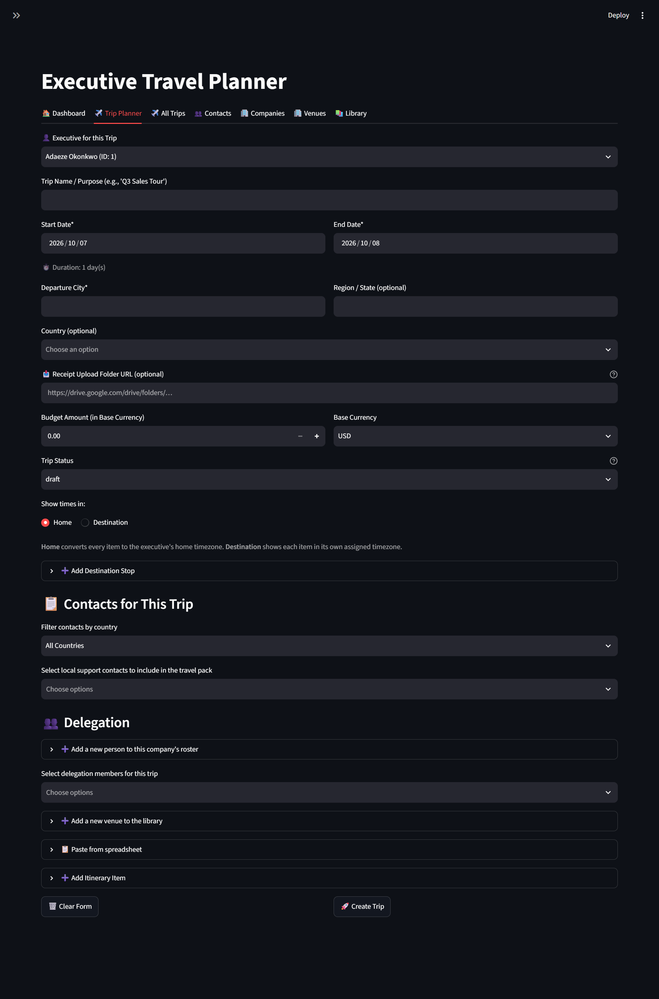
<p align="center"><em>Trip Planner — multi-city creation</em></p>
</td>
</tr>
<tr>
<td width="50%">
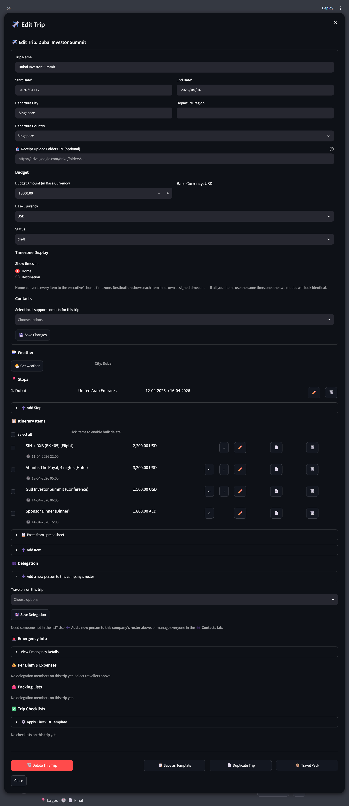
<p align="center"><em>Trip edit modal — full itinerary control</em></p>
</td>
<td width="50%">
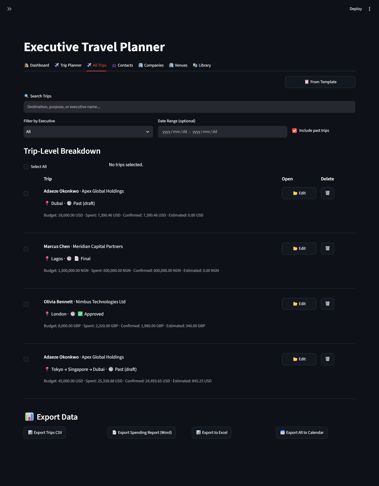
<p align="center"><em>All Trips — filters, mass actions, exports</em></p>
</td>
</tr>
<tr>
<td width="50%">
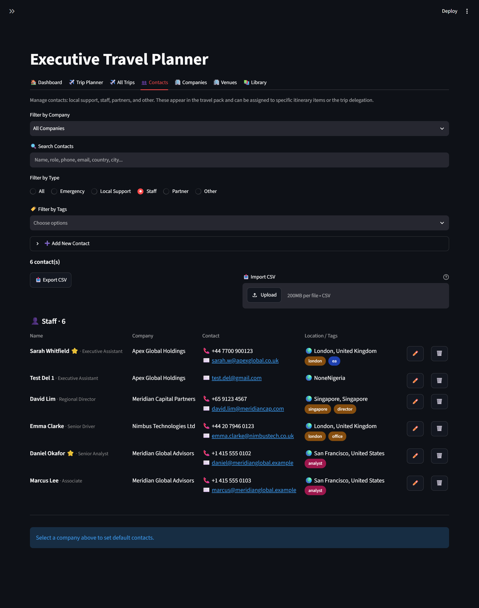
<p align="center"><em>Contacts — grouped by type, filterable</em></p>
</td>
<td width="50%">
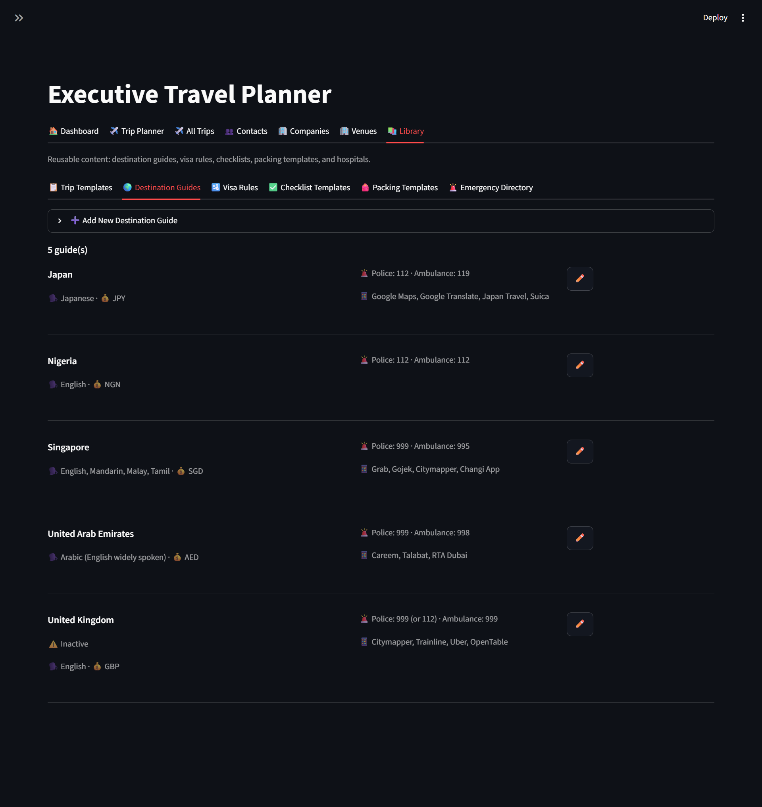
<p align="center"><em>Library — guides, visa rules, templates</em></p>
</td>
</tr>
</table>

---

## 🚀 What's New (v4.1)

### Highlights

| Feature                               | Description                                                                                                                                                                                                                                                                                                                        |
| :------------------------------------ | :--------------------------------------------------------------------------------------------------------------------------------------------------------------------------------------------------------------------------------------------------------------------------------------------------------------------------------- |
| **📱 Responsive Travel Pack**          | The HTML travel pack now adapts to phones with breakpoints at 900 / 640 / 400 px. Tables scroll horizontally within their card instead of squashing; flex grids restack cleanly; typography and padding scale down.                                                                                                                |
| **🌗 Light / Dark Theme**              | The travel pack honours `prefers-color-scheme`. Light mode uses the original off-white palette; dark mode uses a deep forest-green scheme. The PDF always renders in light for clean printing.                                                                                                                                     |
| **🌦️ Date-Aligned Weather**            | Weather is fetched for **each stop's own date window**, not just the first city. Trips beyond the 16-day forecast horizon automatically fall back to last year's same-dates data via Open-Meteo's archive API, labelled clearly as "typical conditions".                                                                           |
| **💱 USD-Normalized Dashboard**        | The Spending Snapshot, "Spend · Month Year" metric, and Spend-by-Executive breakdown now convert every trip's total from its own base currency to USD using the trip's start-date rate. Mixed-currency portfolios no longer sum NGN and USD as if they were equal.                                                                 |
| **🚫 Duplicate Detection**             | Trips, executives, contacts, venues, **trip stops** (same city + overlapping dates), **itinerary items** (same description + start, or matching confirmation code), **passports** (same exec + country), and **memberships** (same exec + program name) all warn before saving a likely duplicate, with an "Add anyway?" override. |
| **⚠️ Delete Confirmations Everywhere** | Every destructive action — trips, stops, items, contacts, venues, guides, visa rules, templates, hospitals, embassies, passports, memberships, expenses, packing lists, checklists — now renders a confirmation panel with **✅ Yes, Delete** / **❌ Cancel**. Bulk deletes are confirmed as well.                                   |
| **🗑️ Row-Level Delete Buttons**        | Every list view now shows **✏️ Edit** and **🗑️ Delete** side-by-side on each row. Previously, deleting a venue, guide, hospital, or embassy required opening the edit form first.                                                                                                                                                    |
| **⏱️ End-Before-Start Warnings**       | Itinerary items whose End time is earlier than Start now raise a warning on save, with a "Save anyway?" checkbox. Applies to per-item add, per-item edit, the create form, and the bulk-paste importer.                                                                                                                            |
| **🔍 Trip Name Search**                | Trips in the All Trips list now display their **Trip Name / Purpose** as the primary heading, and the search filter matches against it. Previously the purpose field was never returned by the summary query, so searching by trip name returned nothing.                                                                          |

### Earlier (v4.0)

| Feature                             | Description                                                                                                                                                                                          |
| :---------------------------------- | :--------------------------------------------------------------------------------------------------------------------------------------------------------------------------------------------------- |
| **🏠 Dashboard Tab**                 | New home tab with at-a-glance metrics: active executives, companies, upcoming trips (30 days), spending snapshot (month / quarter / YTD), per-executive spend breakdown, and library content counts. |
| **📦 Mobile-Ready Travel Pack**      | Self-contained HTML pack with a responsive layout. Inline preview in the app — no need to download and open. Also exports to PDF and Word.                                                           |
| **🌦️ Per-Stop Weather**              | Weather is now shown **for each stop, in its own date window** — not just the first city.                                                                                                            |
| **📋 Bulk Paste Itinerary**          | Paste rows straight from Excel, Google Sheets, or a CSV. Auto-detects headers, previews, and imports.                                                                                                |
| **💰 Bulk Import Expenses**          | Paste a spreadsheet of expenses for an entire delegation in one go. Validates traveler names against the trip roster.                                                                                |
| **📄 Duplicate Trip / Item**         | One-click copy of a trip (with stops, items, delegation, checklists) or an individual item (+1 day shift).                                                                                           |
| **↑ ↓ Reorder**                     | Reorder stops and items with up/down buttons.                                                                                                                                                        |
| **☑ Bulk Item Delete**              | Tick items and delete them in one action, in both the trip modal and the create form.                                                                                                                |
| **➕ Inline Add**                    | Add a new venue or delegation member directly from the form that needs them.                                                                                                                         |
| **📅 Curated Timezone Shortlist**    | Common business-travel timezones surfaced at the top of every timezone dropdown.                                                                                                                     |
| **🛂 Dismissible Passport Warnings** | Acknowledge a passport expiry warning for 90 days.                                                                                                                                                   |
| **📅 Monthly Backup Reminder**       | Banner in the last 5 days of each month if the last backup was >25 days ago.                                                                                                                         |
| **🧩 Library Tab**                   | Destination Guides, Visa Rules, Checklist Templates, Packing Templates, Trip Templates, and an Emergency Directory.                                                                                  |

---

> **⚠️ Note:** All names, email addresses, phone numbers, passport details, hotel
> confirmations, flight numbers, and any other information shown in these
> screenshots are **fictional** and were generated for demonstration purposes
> only. They do not correspond to any real person, company, or booking.

## ✨ Full Feature Breakdown

### 🏠 1. Dashboard


- **Top metrics**: active executives, companies, contacts, total trips.
- **Trip status split**: upcoming (next 30 days), in progress, past.
- **Spending snapshot**: this month, this quarter, this year-to-date — **each converted to USD** using the corresponding trip's start-date exchange rate.
- **Per-executive spend breakdown**, sorted descending, converted to USD.
- **Library content counts** — guides, visa rules, templates, hospitals, embassies, venues.
- **Recently created trips** — five most recent.

> **A note on multi-currency:** every aggregate on the dashboard is normalised to USD. Trip cards in the All Trips list still show figures in each trip's own base currency. If a rate is unavailable for a trip's start date, that trip contributes at face value and a warning caption appears under the snapshot.

### 👤 2. Executive & Company Management

<table>
<tr>
<td width="50%">
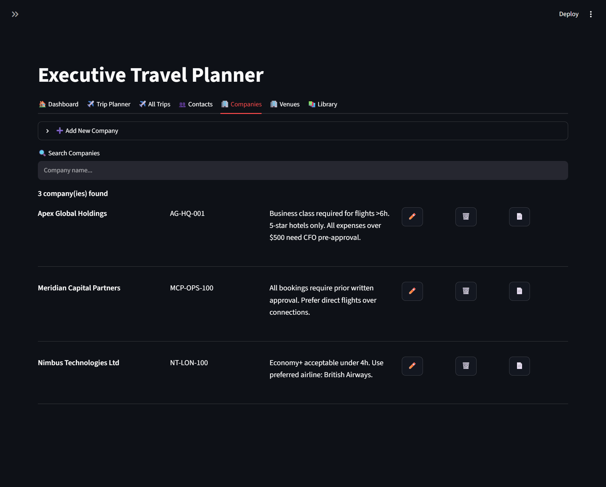
<p align="center"><em>Companies — cost centers, policy notes, default contacts</em></p>
</td>
<td width="50%">
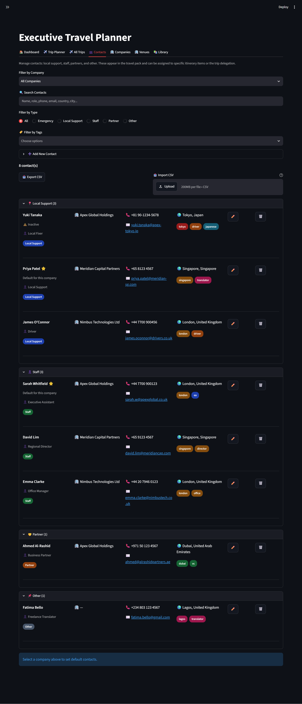
<p align="center"><em>Contacts — grouped by type, filterable</em></p>
</td>
</tr>
</table>

- **Executives**: rich profiles with timezone, seat preference, dietary, meal preference, preferred airline, TSA PreCheck, passport(s), and unlimited memberships.
- **Passports**: multiple per executive, with expiry warnings that escalate at 90 / 180 days and can be dismissed for 90 days. Duplicate detection warns on same-exec + same-country adds.
- **Memberships**: airline, hotel, car rental, lounge, rail, ferry, ride-share, credit card. Duplicate detection warns on same-exec + same-program adds (case-insensitive).
- **Companies**: cost centers, policy notes, default contacts, active/inactive state.
- **Export Profiles**: Word, CSV, Excel.

### 🗺️ 3. Trip Planning (Multi-City)


- **Departure location**: Home Base with City, Region, Country.
- **Stops**: unlimited, with **↑ ↓ reorder**, edit, and delete. Duplicate detection warns on same-city + overlapping-date stops, with a separate warning when dates overlap a stop in a **different** city (physically impossible).
- **Inline venue add**: create a new venue without leaving the stop or item form.
- **Trip status workflow**: Draft → Approved → Final (locks the trip from edits).
- **Timezone display mode**: Home (executive's timezone) or Destination (each item's own timezone). The toggle takes effect immediately in both the create form and the edit modal.

### 📋 4. Itinerary Builder

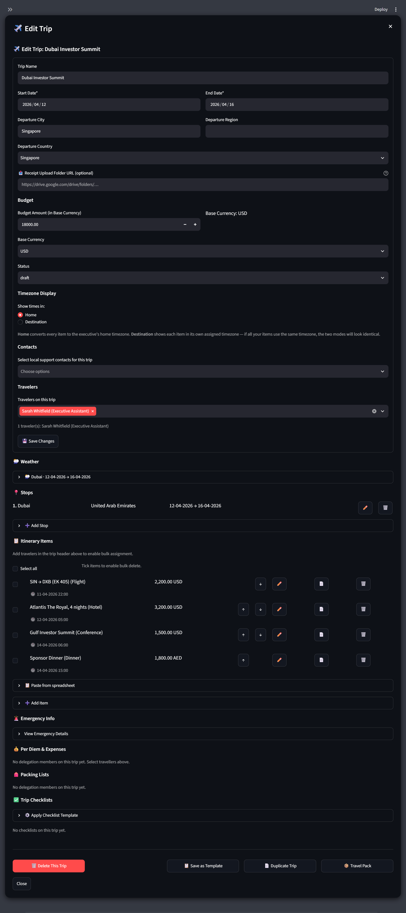

- **Add items individually** or **bulk paste from a spreadsheet** (auto-detects headers, previews before import).
- **Per-item fields**: type, description, start / end, location, cost, currency, cost date, timezone, venue, confirmation code, notes, delegation members, local support contacts.
- **↑ ↓ reorder** items by swapping times with the item above or below.
- **📄 Duplicate item** — copies every field and shifts start / end / cost date forward one day.
- **☑ Batch select and delete** items with a Select-All toggle, guarded by a confirmation panel.
- **Inline venue add** inside every item edit form.
- **Receipt attachments**: upload PNG, JPG, or PDF.
- **Validation on save**: end-before-start time warning (with "Save anyway?"), duplicate-item warning (same description + start, or matching confirmation code), both overridable.

### 💰 5. Budgeting & Expenses

- Set a **Trip Budget** in the base currency; per-item costs in any currency, converted using historical rates on the item's cost date.
- **Spending summary**: Estimated vs. Confirmed vs. Total, live in the trip modal.
- **Per diem**: daily rate and days per traveler.
- **Expenses**: single entry form with receipt upload, plus **bulk import from a spreadsheet** with traveler-name validation.
- **Per-traveler breakdown**: allowance, spent, remaining, color-coded.
- **Conflict detection**: warns on overlapping flights, meetings, and transport.

### 📊 6. All Trips (Spending Dashboard)

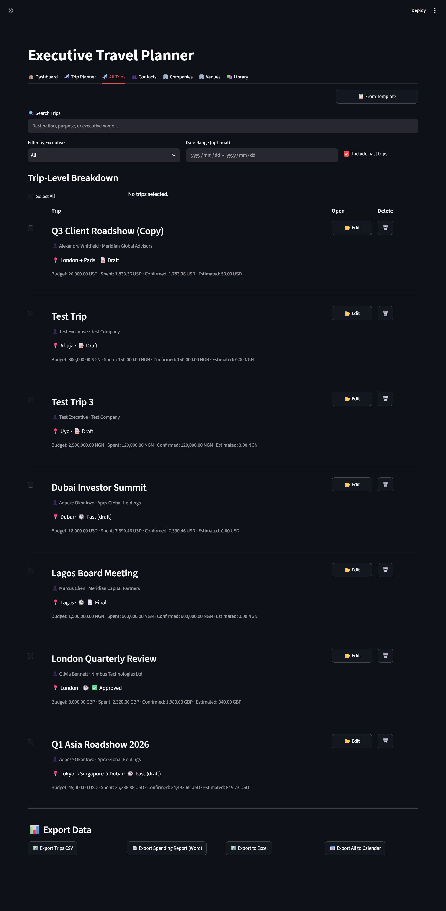

- **Filters**: executive, date range, free-text search (**matches Trip Name, destination, and executive**), "include past trips" toggle.
- **Trip-level breakdown**: each trip card leads with its **Trip Name** as the heading, followed by executive, destination, status, and financials.
- **Mass select and delete** trips in one action, with a confirmation panel.
- **Open any trip** with **📂 Edit** — the full trip edit modal.
- **Export**: CSV, Word, Excel, and `.ics` calendar (all trips in the current filter).

### 👥 7. Contacts

- Contacts filtered by company, type, tag, and free text.
- Contact types: Emergency, Local Support, Staff, Partner, Other — each rendered as its own compact section with column headers.
- **Default contacts per company** auto-populate on new trips.
- **CSV import / export** with duplicate detection. Import result (imported / skipped counts) persists across the rerun so you can see what happened.

### 🏢 8. Venues

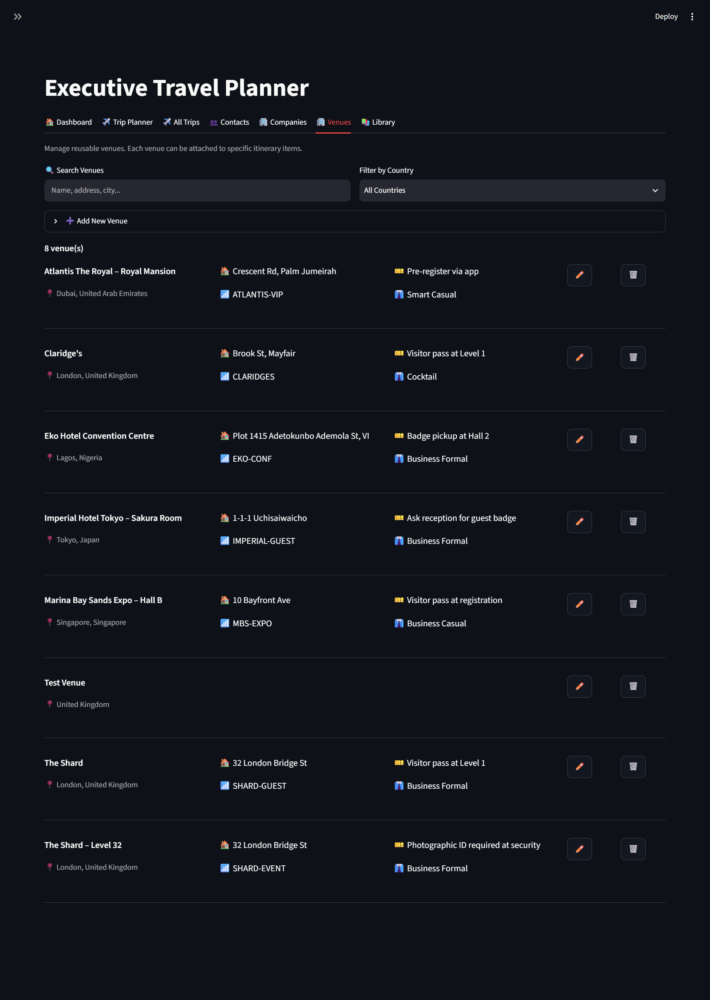

- Reusable venue library with address, city, country, WiFi credentials, badge info, dress code, and notes.
- Attach any venue to a session-type itinerary item (Meeting, Conference, Dinner, Site Visit, Tour, Activity).
- Filter by country, search by name / address / city.
- Row-level **✏️ Edit** and **🗑️ Delete**; deletion nulls the FK on any referencing items.

### 📚 9. Library


Six sub-tabs of reusable content:

- **📋 Trip Templates** — save any trip as a template, then create new trips from it with new dates and budget.
- **🌍 Destination Guides** — language, currency, emergency numbers, etiquette, phrases, packing tips, connectivity notes, recommended apps.
- **🛂 Visa Rules** — passport nationality → destination pairs with visa requirement, max stay, processing time, fee.
- **✅ Checklist Templates** — reusable checklist skeletons, applied per trip.
- **🎒 Packing Templates** — reusable packing lists, applied per traveler.
- **🚨 Emergency Directory** — hospitals (by city / country), emergency numbers per country (sourced from Destination Guides), embassies and consulates (by host and representing country).

Every list in the Library has row-level **✏️ Edit** / **🗑️ Delete** buttons and a confirmation panel for deletes.

### 📄 10. Exports & Reporting

| Export                | Formats                | Description                                                                                                                                                                                                                                                                       |
| :-------------------- | :--------------------- | :-------------------------------------------------------------------------------------------------------------------------------------------------------------------------------------------------------------------------------------------------------------------------------- |
| **Travel Pack**       | HTML + PDF + Word      | Self-contained itinerary: route, per-stop weather (date-aligned, with historical fallback), delegation, hotels, agenda, venues, local support, expenses, packing lists, checklists, emergency info, and embedded receipt images. HTML is responsive and honours light/dark theme. |
| **Itinerary**         | Word + Excel           | Daily agenda with costs, confirmation codes, and timezone-aware times.                                                                                                                                                                                                            |
| **Expense Report**    | Word + Excel           | Items grouped by day with **embedded receipt thumbnails** (Word) or structured spreadsheet (Excel).                                                                                                                                                                               |
| **Executive Profile** | Word + Excel + CSV     | Complete profile with preferences, memberships, and passport details.                                                                                                                                                                                                             |
| **Company Profile**   | HTML + Word + Excel    | Company overview with executives, contacts, and policy notes.                                                                                                                                                                                                                     |
| **Calendar**          | .ics                   | Multi-trip calendar export — one event per itinerary item, prefixed with the trip name.                                                                                                                                                                                           |
| **Spending Report**   | Word + Excel + CSV     | Aggregate reports with totals and trip-level breakdowns.                                                                                                                                                                                                                          |
| **Database**          | JSON + CSV (ZIP) + .db | Full snapshot for backup or migration.                                                                                                                                                                                                                                            |

---

## 🛠️ Tech Stack

| Layer                 | Technology                                                            |
| :-------------------- | :-------------------------------------------------------------------- |
| **Language**          | Python 3.10+                                                          |
| **UI Framework**      | Streamlit                                                             |
| **Database**          | SQLite (local `.db` file, WAL mode)                                   |
| **Word Documents**    | python-docx                                                           |
| **PDF Rendering**     | WeasyPrint (requires pydyf — see Troubleshooting for version pairing) |
| **HTML Templating**   | Jinja2                                                                |
| **Excel Export**      | openpyxl                                                              |
| **Calendar Files**    | icalendar                                                             |
| **Timezone Handling** | pytz                                                                  |
| **Country Dropdown**  | pycountry                                                             |
| **Weather**           | Open-Meteo (no API key required)                                      |
| **Data Export**       | Built-in `csv` module                                                 |

---

## 📦 Installation & Setup

### 1. Prerequisites

- Python **3.10** or higher

- **WeasyPrint system libraries** for PDF export:

  - **macOS**: `brew install pango libffi`

  - **Ubuntu / Debian**:
    `sudo apt install libpango-1.0-0 libpangoft2-1.0-0`

  - **Windows (MSYS2 UCRT64)** — required. WeasyPrint on Windows needs
    the Pango / Cairo / GDK-Pixbuf DLLs, which MSYS2 supplies. Install
    MSYS2 from <https://www.msys2.org/> (default location `C:\msys64`),
    then open the **UCRT64** shell and run:

    ```bash
    pacman -Syu
    pacman -S mingw-w64-ucrt-x86_64-pango \
              mingw-w64-ucrt-x86_64-gdk-pixbuf2 \
              mingw-w64-ucrt-x86_64-cairo
    ```

    The bundled `run.bat` adds `C:\msys64\ucrt64\bin` to `PATH` and sets
    `WEASYPRINT_DLL_DIRECTORIES` so Python can find these DLLs. If your
    MSYS2 lives somewhere other than `C:\msys64`, edit `run.bat`
    accordingly.

    Without this step, PDF exports fail with an error like
    `OSError: cannot load library 'gobject-2.0-0'`.

- **Python package compatibility**: WeasyPrint and pydyf must be a matching
  pair. If you see `TypeError: PDF.__init__() takes 1 positional argument but 2
  were given`, upgrade both together:

  ```bash
  pip install --upgrade --force-reinstall weasyprint pydyf
  ```

  See Troubleshooting for the version pairing table.

### 2. Download the Project

```
travel-planner/
├── run.bat
├── app.py
├── database.py
├── doc_generator.py
├── excel_export.py
├── currency.py
├── duplicate_detection.py
├── utils.py
├── weather.py
├── templates/
│   ├── travel_pack.html
│   └── company_profile.html
├── docs/
│   └── screenshots/
├── requirements.txt
└── README.md
```

### 3. Run the Setup Commands

```bash
python -m venv venv

# Windows:
venv\Scripts\activate
# Mac / Linux:
source venv/bin/activate

pip install -r requirements.txt
```

### 4. Launch

**Windows:** double-click **`run.bat`** — see the *Running the App*
section below for details.

**macOS / Linux:** `streamlit run app.py` from an activated venv.

---

## ▶️ Running the App

### Windows — recommended

Double-click **`run.bat`** in the project folder. It handles three things at once:

```bat
@echo off
set PATH=C:\msys64\ucrt64\bin;%PATH%
set WEASYPRINT_DLL_DIRECTORIES=C:\msys64\ucrt64\bin
venv\Scripts\python.exe -m streamlit run app.py
```

- Prepends MSYS2's UCRT64 `bin` folder to `PATH` so WeasyPrint's native
  libraries (Pango, Cairo, GDK-Pixbuf) are discoverable.
- Sets `WEASYPRINT_DLL_DIRECTORIES` — WeasyPrint's own fallback location
  hint for those DLLs.
- Runs the venv's Python directly, so no `activate` step is needed.

Your browser opens at `http://localhost:8501`. On first run,
`travel_planner.db` is created and all tables are set up automatically.
Migrations run on every start, so schema updates are applied without
manual work.

> **Path dependency:** `run.bat` assumes MSYS2 is installed at
> `C:\msys64`. If yours lives elsewhere, edit both lines and point them
> at your own `ucrt64\bin`.

> **Why a launcher instead of a plain `streamlit run app.py`?**
> On Windows, WeasyPrint loads several native DLLs at import time. Those
> DLLs live in MSYS2's UCRT64 `bin` folder, which is not on the default
> Windows `PATH`. `run.bat` sets both `PATH` and
> `WEASYPRINT_DLL_DIRECTORIES` in a single keystroke so the app works the
> same way every time — without touching system-wide environment
> variables or needing an activated shell.

### Windows — from an activated shell

If you prefer running from an interactive terminal (useful while
debugging), the same environment variables must be set before Streamlit
starts:

```bat
set PATH=C:\msys64\ucrt64\bin;%PATH%
set WEASYPRINT_DLL_DIRECTORIES=C:\msys64\ucrt64\bin
venv\Scripts\activate
python -m streamlit run app.py
```

### macOS / Linux

```bash
source venv/bin/activate
streamlit run app.py
```

Native PDF rendering on macOS and Linux needs no extra environment
setup once the system libraries from the Installation section are
installed.

---

## 🧠 How the PA/EA Uses It (Daily Workflow)

**Launch:** double-click `run.bat`. The app opens in your browser at
`http://localhost:8501`.

1. **Select Executive** — choose from the sidebar. Their timezone, preferences, and passport warnings load immediately.
2. **Create Trip** — enter purpose, dates, departure city, budget, and base currency. Status starts as Draft.
3. **Add Stops** — one at a time, in the order they'll be visited. Use ↑ ↓ to reorder. Duplicate / physically-impossible date overlaps are flagged with an override.
4. **Add Delegation** — pick travelers from the company roster, or use the **➕ Add a new person** expander inline.
5. **Plan Itinerary** — add items one at a time, or **📋 Paste from spreadsheet**. Every item carries cost, currency, timezone, venue, and contacts. End-before-start and duplicate warnings are overridable.
6. **Attach Receipts** — upload per item, or drop them in the shared folder URL (shown on the travel pack).
7. **Set Per Diem & Expenses** — daily rate × days per traveler. Bulk import expenses from a spreadsheet.
8. **Review** — spending summary (converted to the trip base currency), budget usage, conflict warnings, and a live travel pack preview.
9. **Generate Travel Pack** — one click gives the executive a phone-friendly HTML, a PDF, or a Word document. The HTML respects the reader's light/dark preference.
10. **Export** — Word / Excel / CSV / .ics from the All Trips tab, or push the trip through Draft → Approved → Final when ready.
11. **Reuse** — save recurring trips as templates in the Library, then create new trips from them in one click.

---

## 📤 Complete Export Matrix

| **What You Want to Export** | **HTML** | **PDF** | **Word** | **Excel** | **CSV** | **ICS** |
| :-------------------------- | :------: | :-----: | :------: | :-------: | :-----: | :-----: |
| **Travel Pack**             |    ✅     |    ✅    |    ✅     |     —     |    —    |    —    |
| **Executive Profile**       |    —     |    —    |    ✅     |     ✅     |    ✅    |    —    |
| **Company Profile**         |    ✅     |    —    |    ✅     |     ✅     |    —    |    —    |
| **Trip Itinerary**          |    —     |    —    |    ✅     |     ✅     |    —    |    —    |
| **Expense Report**          |    —     |    —    |    ✅     |     ✅     |    —    |    —    |
| **Multi-Trip Calendar**     |    —     |    —    |    —     |     —     |    —    |    ✅    |
| **Spending Dashboard**      |    —     |    —    |    ✅     |     ✅     |    ✅    |    —    |
| **Full Database**           |    —     |    —    |    —     |     —     |   ZIP   |    —    |

---

## 📊 What Each Export Looks Like

### 📦 Travel Pack

- **HTML** — self-contained, responsive, mobile-friendly. Embeds receipt images inline as base64. Coloured cards for each section: route, weather (per stop), delegation, hotels, agenda, venues, local support, expenses, packing lists, checklists, emergency info.
  - **Light / dark theme** — automatically adapts to the reader's OS-level `prefers-color-scheme`. Light mode uses the original off-white palette with a blue accent; dark mode uses a deep forest-green scheme.
  - **Responsive** — breakpoints at 900 / 640 / 400 px. Tables scroll horizontally within their card on narrow screens; flex grids restack; typography and padding scale down.
  - **Two-column packing lists and checklists** — category items render side-by-side on wide screens, single-column on phones.
- **PDF** — same layout, rendered via WeasyPrint. Always renders in **light** theme regardless of the reader's OS preference, so printed copies stay clean. Page breaks preserve section integrity.
- **Word** — parallel implementation with native Word headings and tables. Simpler than the HTML/PDF — no weather section, no receipts, no CSS styling. Suitable when a `.docx` is specifically required; otherwise prefer HTML or PDF.

### 📄 Word Documents

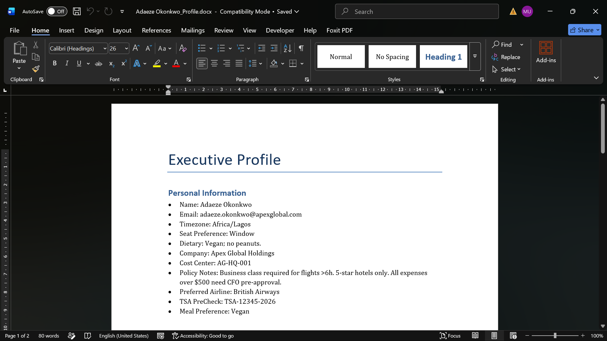

- **Itinerary** — title, route summary, executive profile, sorted daily agenda, conflict warnings, spending summary.
- **Expense Report** — days as headings, tables with Time / Description / Type / Cost / Receipt, embedded receipt thumbnails, daily totals, grand totals.
- **Executive Profile** — company header, preference table, memberships, and finance details.
- **Spending Report** — executive name, date range, aggregate metrics, trip-level breakdown.
- **Company Profile** — company header, executive roster, contact list, policy notes.

### 📊 Excel Spreadsheets

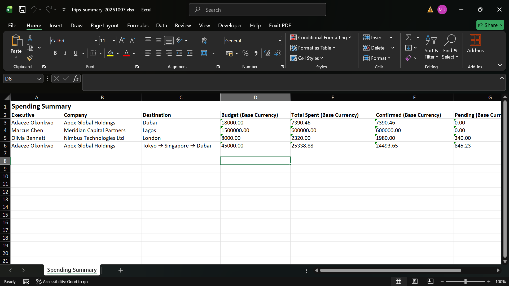

- **Executive Profile** — key/value table + separate memberships sheet.
- **Itinerary** — 3 sheets: Trip Summary, Stops, Itinerary Items.
- **Expense Report** — grouped by day with Date merged, Time, Description, Type, Cost, Receipt; day subtotals; grand totals.
- **Spending Dashboard** — filtered data with bold headers and a totals row.

### 📅 Calendar (.ics)

Standard iCalendar format. Double-click to import into Google Calendar, Apple Calendar, or Outlook. Events are timezone-aware and include confirmation codes. Multi-trip export names each event with the trip's purpose.

### 💾 Database Snapshot

- **JSON** — every table, structured. Ideal for inspection or migration.
- **CSV (ZIP)** — one CSV per table. Ideal for spreadsheet-based analysis.
- **.db** — a byte-for-byte copy of `travel_planner.db`. The safest backup.

---

## 🗃️ File Structure

```
travel-planner/
├── run.bat                         # Windows launcher — sets MSYS2 paths,
│                                   # then starts Streamlit via the venv
├── app.py                          # Streamlit UI — every tab and form
├── database.py                     # SQLite schema, migrations, CRUD
├── doc_generator.py                # Travel Pack (HTML / PDF / Word),
│                                   # company & exec profiles, spending report
├── excel_export.py                 # Excel exports
├── utils.py                        # Timezone helpers, ICS export, bulk parsers
├── currency.py                     # Exchange rate fetching + conversion + symbols
├── duplicate_detection.py          # Fuzzy matching for execs, trips, contacts, venues
├── weather.py                      # Weather fetching (current, forecast, range)
├── templates/
│   ├── travel_pack.html            # Jinja2 template for the HTML travel pack
│   └── company_profile.html        # Jinja2 template for the HTML company profile
├── docs/
│   └── screenshots/                # README images
├── requirements.txt
├── travel_planner.db               # SQLite database (auto-created)
├── app_state.json                  # Backup reminder state (auto-created)
├── dismissed_warnings.json         # Acknowledged passport warnings (auto-created)
├── weather_cache.json              # Cached weather responses (auto-created)
├── receipts/
│   └── trip_<id>/                  # Per-trip receipt uploads (auto-created)
└── README.md
```

**Database highlights:**

- **Automatic migrations** — schema upgrades run on every startup; no manual SQL.
- **Cascade deletes** — deleting a trip removes its stops, items, delegation, per-diem, expenses, packing lists, and checklists.
- **WAL mode** — a single writer, many readers, so reads don't block writes.

---

## 💱 Currency & Date Management

- **Multi-currency**: set a base currency per trip; enter costs in any supported currency.
- **Historical accuracy**: each item carries a **cost date**; conversion uses the rate on that date, not today's rate. Rates are fetched from a free API and cached in the database.
- **Dashboard normalisation**: the Dashboard, Spending Snapshot, and Spend-by-Executive views convert **every trip's total to USD** using that trip's start-date rate. Trip cards in the All Trips list continue to show figures in each trip's own base currency.
- **Date format**: DD-MM-YYYY throughout the UI and every exported document.
- **Timezone dropdown**: curated shortlist of ~28 business-travel zones at the top, followed by the full list, each showing its current abbreviation (e.g. `America/New_York (EDT)`).

---

## 🚫 Duplicate Detection

Duplicate checks are deliberately **scoped**: they apply where a duplicate would confuse a picker or leak into a downstream view, and are skipped where a legitimate business case exists for similar records.

| Entity                | What triggers the warning                                                                                                | Overridable?                                       |
| :-------------------- | :----------------------------------------------------------------------------------------------------------------------- | :------------------------------------------------- |
| **Executive**         | Same email, or same name + company                                                                                       | ✅                                                  |
| **Trip**              | Same executive + purpose + overlapping dates                                                                             | ✅                                                  |
| **Contact**           | Same company + same name / email / phone                                                                                 | ✅                                                  |
| **Venue**             | Same name                                                                                                                | ✅                                                  |
| **Trip stop**         | Same city + overlapping dates *(yellow)*, or different city + strictly-overlapping dates *(red — physically impossible)* | ✅                                                  |
| **Itinerary item**    | Same description + same start time, or matching confirmation code                                                        | ✅                                                  |
| **Passport**          | Same executive + same country                                                                                            | ✅                                                  |
| **Membership**        | Same executive + same program name (case-insensitive)                                                                    | ✅                                                  |
| **Destination guide** | Same country                                                                                                             | ❌ *(hard block — one guide per country by design)* |
| **Visa rule**         | Same passport nationality → destination pair                                                                             | ❌ *(hard block)*                                   |

**Not checked:** hospitals and embassies. These are pure reference content — they appear in one admin view and one travel pack, are never picked from a dropdown, and don't leak into other screens. Adding a duplicate check would add friction with little benefit. If a duplicate slips in, the row-level 🗑️ button removes it.

---

## ⚠️ Known Issues & Limitations

An honest list of what doesn't work as well as it could, and why. Nothing here is a bug that breaks the app — these are either deliberate design choices, upstream API constraints, Streamlit behaviour quirks, or features not yet built.

### Behaviour worth understanding

| Limitation                                                           | Impact                                                                                                                                                                                                                                                                                                                                                                                                                     | Workaround                                                                                                                                                                                     |
| :------------------------------------------------------------------- | :------------------------------------------------------------------------------------------------------------------------------------------------------------------------------------------------------------------------------------------------------------------------------------------------------------------------------------------------------------------------------------------------------------------------- | :--------------------------------------------------------------------------------------------------------------------------------------------------------------------------------------------- |
| **Form does not clear after saving**                                 | After clicking **💾 Save**, **➕ Add**, or **🚀 Create Trip**, the record is persisted correctly, but the input fields retain their values. For a single-row form (Venue, Contact, Hospital, Embassy, Guide, Template) that's harmless — you usually navigate away. For the multi-row forms (Trip Planner create form, "+ Add Itinerary Item" expander), you have to manually clear the fields before entering the next item. | Click **🗑️ Clear Form** where it exists. For expander forms without a clear button, either close and reopen the expander or ignore the values and re-enter.                                     |
| **Dashboard aggregates ignore expenses and per-diem**                | The "Spent" figures everywhere on the Dashboard and in the All Trips list come from **itinerary item costs only**. The `expenses` table (per-traveller meals, taxis, incidentals) and per-diem allowances are tracked separately and never fold into any dashboard figure.                                                                                                                                                 | If your workflow logs actual costs via the expense form, the dashboard is a **planning** view, not a reconciliation view. Use the modal's Per-Traveller Breakdown for actual expense tracking. |
| **Trips that straddle a month/quarter boundary count fully in both** | A trip Aug 30 – Sep 3 contributes its full `total_spent` to **both** the August and September totals. The sum of 12 monthly figures will exceed YTD.                                                                                                                                                                                                                                                                       | For "spend that occurred in October," you'd need to prorate by item cost_date — not currently computed anywhere.                                                                               |
| **Multi-currency conversion falls back silently**                    | If no exchange rate is cached for a currency pair on the item's cost_date, the raw amount is used as if it were already in the target currency. A ¥50,000 item with no JPY→USD rate becomes 50,000 "USD" — a 150× inflation. A warning caption appears under the Spending Snapshot but the trip card itself shows no flag.                                                                                                 | Run **💱 Exchange Rates → 🔄 Refresh Rates Now** before entering foreign-currency items. For ongoing correctness, seed rates for the currencies you use most often.                              |
| **Word travel pack is lower fidelity than HTML/PDF**                 | The Word generator is a separate code path. It has **no weather section, no receipts, no CSS styling**, and splits hotels / agenda into distinct tables instead of the unified card layout.                                                                                                                                                                                                                                | Prefer HTML or PDF unless a `.docx` is specifically required by your org.                                                                                                                      |
| **Weather beyond 16 days is a proxy, not a forecast**                | Open-Meteo's forecast API covers up to 16 days ahead. For trips further out, the app falls back to last year's same-dates data from the archive API, clearly labelled "typical conditions." This is climate, not a forecast.                                                                                                                                                                                               | Nothing to fix — it's an upstream API limit. The label on the panel makes this explicit.                                                                                                       |
| **Weather cities may not resolve**                                   | The geocoder (`geocoding-api.open-meteo.com`) matches on city name only. Ambiguous names ("Springfield", "Cambridge") may resolve to the wrong location, and some spelling variants won't resolve at all.                                                                                                                                                                                                                  | Use the well-known form of the city name. If a city fails, the weather section is silently omitted for that stop rather than showing an error.                                                 |
| **The travel pack's wide tables scroll horizontally on phones**      | On screens under ~640px, tables with 5–6 columns (Agenda, Expense Details) force horizontal scrolling inside their card. This is intentional — the alternative was character-by-character wrapping, which was worse.                                                                                                                                                                                                       | Rotate the phone to landscape, or view the PDF.                                                                                                                                                |
| **Bulk paste does not duplicate-check or validate times**            | The bulk itinerary importer and bulk expense importer parse rows and insert them. Duplicate detection and end-before-start validation only run on the per-item add / edit forms.                                                                                                                                                                                                                                           | After a bulk import, review the item list. Duplicates and inverted times will appear but won't have been flagged during import.                                                                |
| **No user authentication**                                           | The app has no login. Anyone who can reach `http://localhost:8501` can use it. It's designed for single-PA use on a local machine.                                                                                                                                                                                                                                                                                         | Do not expose the port to a network. Keep it bound to `localhost` (the default).                                                                                                               |
| **No undo**                                                          | Delete confirmations prevent accidents, but once you click **✅ Yes, Delete** on a trip or executive, the row and all its related data are gone. No recycle bin, no soft-delete.                                                                                                                                                                                                                                            | The monthly backup reminder exists for exactly this reason. Back up before large cleanups.                                                                                                     |
| **Receipt uploads are stored as files, not in the database**         | The `.db` backup **does not include** the `receipts/` folder. Restoring a `.db` on a different machine gives you the item rows but not the attached images.                                                                                                                                                                                                                                                                | Back up the `receipts/` folder alongside `travel_planner.db`. Or export the travel pack to HTML — receipts are embedded as base64 in that file.                                                |

### UI quirks (Streamlit rendering behaviour)

| Quirk                                                                    | Symptom                                                                                                                                                                                                                                                                                                                       | Why                                                                                                                                                                                                                                                                                                                                                                         | Workaround                                                                                                                                                                                                                                                                                                                                                                           |
| :----------------------------------------------------------------------- | :---------------------------------------------------------------------------------------------------------------------------------------------------------------------------------------------------------------------------------------------------------------------------------------------------------------------------- | :-------------------------------------------------------------------------------------------------------------------------------------------------------------------------------------------------------------------------------------------------------------------------------------------------------------------------------------------------------------------------- | :----------------------------------------------------------------------------------------------------------------------------------------------------------------------------------------------------------------------------------------------------------------------------------------------------------------------------------------------------------------------------------- |
| **Select All does not visually tick the child checkboxes**               | On the **✈️ All Trips** list and inside the trip modal's **Itinerary Items** section, clicking **Select All** updates the underlying selection set, but the individual row checkboxes remain visually unchecked. Actions like **🗑️ Delete N selected** still operate on the correct rows — the state is right, the visuals lag. | Streamlit's checkbox widget, once rendered with a `key=`, ignores the `value=` parameter on subsequent runs and reads its state from `session_state[key]`. The "Select all" handler updates the *aggregate* set (`selected_trip_ids`), not the per-row widget keys (`sel_{trip_id}`). The aggregate drives the actions; the individual keys drive the visuals. They desync. | Click any individual checkbox once — that forces the widget to re-read its state and everything visually snaps into place. To fully fix, the "Select all" handler would also need to write `st.session_state[f"sel_{trip_id}"] = True` for every row (and `False` for a deselect), which is a small but non-trivial change across both the All Trips list and the modal's item list. |
| **Timezone display toggle appears to do nothing**                        | Switching **Show times in:** between *Home* and *Destination* has no visible effect on the item captions.                                                                                                                                                                                                                     | Only matters when at least one item has a timezone different from the executive's home timezone. If every item uses the exec's tz (the default when you don't explicitly set one per item), both modes render identical text.                                                                                                                                               | Edit one item and set its **Time Zone** to a region different from the exec's. The toggle will then produce visibly different times.                                                                                                                                                                                                                                                 |
| **Filter dropdowns occasionally retain stale values after data changes** | Changing a filter (e.g., switching Executive) may briefly show the previous selection until you interact with the page again.                                                                                                                                                                                                 | Streamlit re-renders the whole script on any interaction, but widget state keyed by label can lag one cycle behind data-driven changes.                                                                                                                                                                                                                                     | Click anywhere on the page or press **R** to force a full rerun.                                                                                                                                                                                                                                                                                                                     |

### By design (not bugs)

| Behaviour                                               | Why                                                                                                                                                                                |
| :------------------------------------------------------ | :--------------------------------------------------------------------------------------------------------------------------------------------------------------------------------- |
| **Hospitals and embassies have no duplicate detection** | They are pure reference content. They never appear in a picker, and a duplicate doesn't confuse any downstream view. Row-level 🗑️ handles cleanup.                                  |
| **Deleting a company is refused if it has executives**  | Prevents orphaning an executive from its company. Reassign or delete the executives first.                                                                                         |
| **Approved / Final trips are read-only**                | Deliberate — the status workflow exists so a finalized trip can't be silently modified. Use **↩️ Revert to Draft** to unlock.                                                       |
| **Wayback-only historical weather**                     | The archive API is used for deep-past requests. Historical entries cache for 30 days; recent and future entries cache for 1 hour.                                                  |
| **Delete buttons next to every row**                    | Every list view shows **✏️ Edit** and **🗑️ Delete** side-by-side. This was deliberate — previously, deleting some records required opening the edit form first, which was confusing. |

### Not yet implemented

- **Prorated monthly spend** — attributing item costs to the specific month they occurred in, rather than counting the whole trip.
- **Auto-clear forms after save** — several multi-field forms leave their values in place after a successful save (see the first row above).
- **Proper Select-All state sync** — the visual desync described above would need the "Select all" handler to write per-row widget keys.
- **Recurring expense splitting across travellers** — expenses are attributed to one traveller per row.
- **Per-item multi-leg flights** — a flight is a single item; you cannot model connections within one entry.
- **Bulk editing** — batch update selected items (e.g., shift all by one day).
- **Delegation seat assignment** — seat preferences live on the executive profile, not per-traveller per-trip.
- **Auto-refresh weather** — the weather panel fetches on demand; the cached result persists for the session and doesn't auto-refresh.

## 🧩 Extending the Tool

### Adding a New Field to Executive Profiles

1. **`database.py`** — add the column to the `for col, ddl in [...]` list in `migrate_db()`.
2. **`database.py`** — add the parameter to `add_executive()` and `update_executive()`.
3. **`app.py`** — add the input field in the executive form and pass it to the DB functions.
4. **`doc_generator.py`** — add the field to the profile doc generation.
5. **`excel_export.py`** — add the field to `export_profile_to_excel()`.

### Adding a New Itinerary Category

The category list is seeded on first run and can be extended by inserting into the `categories` table:

```sql
INSERT INTO categories (name) VALUES ('Helicopter');
```

The new category appears in every Type dropdown immediately.

### Adding a New Export Format

1. Write a new function in `excel_export.py` (or a new module).
2. Import it into `app.py`.
3. Add a button in the relevant section and call the function.

### Adding a Bulk Import Parser

Two parsers already exist in `utils.py`:

- `parse_itinerary_paste(raw_text, default_timezone)` — TSV / CSV → itinerary items
- `parse_expense_paste(raw_text, default_currency)` — TSV / CSV → expenses

Both return `(parsed_rows, errors)`. Follow the same shape for any new bulk-import UI.

### Customising the Travel Pack

The travel pack's appearance is fully editable via `templates/travel_pack.html`:

- **Recolour** — the `<style>` block defines a light palette and a dark-green override inside `@media (prefers-color-scheme: dark)`. Change the CSS variables on `:root` in one place to restyle.
- **Change fonts** — swap the Google Fonts `<link>` at the top and the two `font-family` declarations.
- **Reorder / hide sections** — each `<div class="card">` block is one section. Move or delete.
- **Add new sections** — template changes plus new context keys passed from `generate_travel_pack_html()` in `doc_generator.py`.

Because HTML and PDF share the same template, one edit updates both. The PDF block in the CSS explicitly forces the light palette so printed output stays clean.

### Updating Screenshots

Screenshots live in `docs/screenshots/`. To refresh one:

1. Open the app in a browser at a **consistent window size** (recommended: 1440 × 900).
2. Use your OS screenshot tool or a browser extension (Firefox's built-in, Chrome DevTools "Capture screenshot").
3. Save with the same filename — the README will pick up the new image automatically.
4. Keep PNG for UI screenshots; PNG keeps text crisp. For exports (Word/Excel previews), PNG or JPG both work.

---

## 🔒 Data Backup

This is a local tool, so **backups are your responsibility**. The app helps:

- **📤 Export Database → ⬇️ Backup .db** — one-click timestamped copy of your database.
- **📤 Export Database → JSON / CSV (ZIP)** — for inspection or migration.
- **📅 Monthly reminder** — a banner appears in the last 5 days of each month if the last backup was more than 25 days ago. Click **✅ Mark as Backed Up** to acknowledge and silence the reminder.

For extra safety, sync `travel_planner.db` to a cloud drive (Dropbox, OneDrive, iCloud) once a week.

---

## 🐞 Troubleshooting

| Issue                                                                                       | Solution                                                                                                                                                                                                 |
| :------------------------------------------------------------------------------------------ | :------------------------------------------------------------------------------------------------------------------------------------------------------------------------------------------------------- |
| **`No module named 'streamlit'`**                                                           | Activate the venv, then `pip install -r requirements.txt`.                                                                                                                                               |
| **Port 8501 is busy**                                                                       | `streamlit run app.py --server.port 8502`.                                                                                                                                                               |
| **`StreamlitDuplicateElementKey`**                                                          | Two widgets share a `key`. Common causes: a widget block pasted twice, or a form submit button with an identical label rendered twice in the same form. See the diagnostic below.                        |
| **`No module named 'utils'`**                                                               | Ensure all `.py` files sit in the same folder as `app.py`.                                                                                                                                               |
| **`No module named 'weather'`**                                                             | Add `weather.py` (used by the trip modal and the travel pack).                                                                                                                                           |
| **Excel export fails**                                                                      | Check `openpyxl` is installed.                                                                                                                                                                           |
| **PDF export fails**                                                                        | Install WeasyPrint system libraries (see Installation). On Windows, confirm `run.bat` points at a valid MSYS2 install and that the Pango package is present.                                             |
| **`OSError: cannot load library 'gobject-2.0-0'`**                                          | MSYS2's UCRT64 `bin` folder isn't on `PATH`. Use `run.bat`, or set `PATH` and `WEASYPRINT_DLL_DIRECTORIES` manually as shown in *Running the App*.                                                       |
| **`TypeError: PDF.__init__() takes 1 positional argument but 2 were given`**                | WeasyPrint and pydyf are a mismatched pair. Fix: `pip install --upgrade --force-reinstall weasyprint pydyf`. See version pairing table below.                                                            |
| **`TypeError: 'builtin_function_or_method' object is not iterable`** (from the travel pack) | A Jinja2 template is trying to iterate `pl.items` or `cl.items` — Jinja resolves `.items` to the dict method, not the key. Fix: use `pl['items']` and `cl['items']` in `templates/travel_pack.html`.     |
| **`bash: streamlit: command not found`**                                                    | Use `python -m streamlit run app.py`, or just run `run.bat`.                                                                                                                                             |
| **`run.bat` opens and immediately closes**                                                  | Something failed before the browser opened. Run `run.bat` from an existing `cmd` window instead of double-clicking it — the window won't close on error, and you'll see the traceback.                   |
| **`run.bat` runs the wrong Python**                                                         | Confirm `venv\Scripts\python.exe` exists. If your venv lives elsewhere, edit the last line of `run.bat`.                                                                                                 |
| **Travel pack is empty / broken layout**                                                    | Confirm `templates/travel_pack.html` exists and is valid HTML.                                                                                                                                           |
| **Weather section missing in travel pack**                                                  | Check the city names on the trip's stops; some spellings may not resolve. If all cities fail, the section is silently omitted. For trips beyond 16 days out, the archive fallback may not have data yet. |
| **Timezone toggle doesn't change item times**                                               | Only items with a timezone different from the executive's home timezone show a visible change. If all items share the exec's timezone, both modes render identically — that's expected.                  |
| **Dashboard totals look inflated**                                                          | A trip's base currency may differ from USD and no rate was available at its start date. Check the warning caption under the Spending Snapshot, then run **💱 Exchange Rates → 🔄 Refresh Rates Now**.      |
| **Database is locked**                                                                      | Only one PA/EA uses it — restart the app. WAL mode reduces this to near-zero.                                                                                                                            |
| **VS Code shows import errors**                                                             | Select the venv interpreter: `venv\Scripts\python.exe`.                                                                                                                                                  |

### WeasyPrint / pydyf version pairing

If PDF export fails with a `PDF.__init__()` signature error, the two packages are out of sync. Use one of these pairings:

| WeasyPrint | Compatible pydyf     |
| :--------- | :------------------- |
| 60.x       | `pydyf>=0.8.0,<0.10` |
| 61.x       | `pydyf>=0.10.0`      |
| 62.x       | `pydyf>=0.10.0`      |

Simplest fix: `pip install --upgrade --force-reinstall weasyprint pydyf`.

### Duplicate key diagnostic

If you see `StreamlitDuplicateElementKey` on a trip checkbox, run:

```bash
python -c "
import database as db
summary = db.get_spending_summary()
print('Rows:', len(summary))
seen = {}
for i, t in enumerate(summary):
    raw = t.get('trip_id')
    seen.setdefault((raw, type(raw).__name__), []).append(i)
for k, idxs in seen.items():
    if len(idxs) > 1:
        print('DUPLICATE:', k, 'at', idxs)
"
```

If a `DUPLICATE` line appears, `get_spending_summary()` is returning two rows for the same trip. The All Trips tab already dedupes on display, but the underlying query should be investigated.

If the error names a `FormSubmitter:` key, a form has two submit buttons with the same label. Search `app.py` for the label and confirm exactly one `st.form_submit_button("…")` call per form.

---

## 📄 License

This tool is proprietary and built specifically for internal administrative use. You are free to use and modify it for your own company workflows.

---

**Happy Planning! ✈️**

---

*Built with ❤️ for Executive Assistants and Personal Assistants everywhere.*